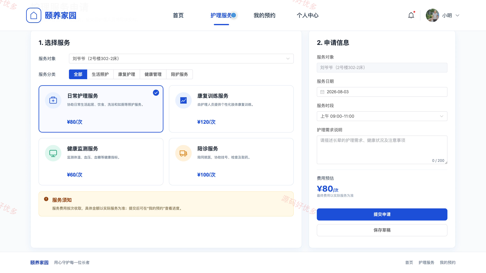
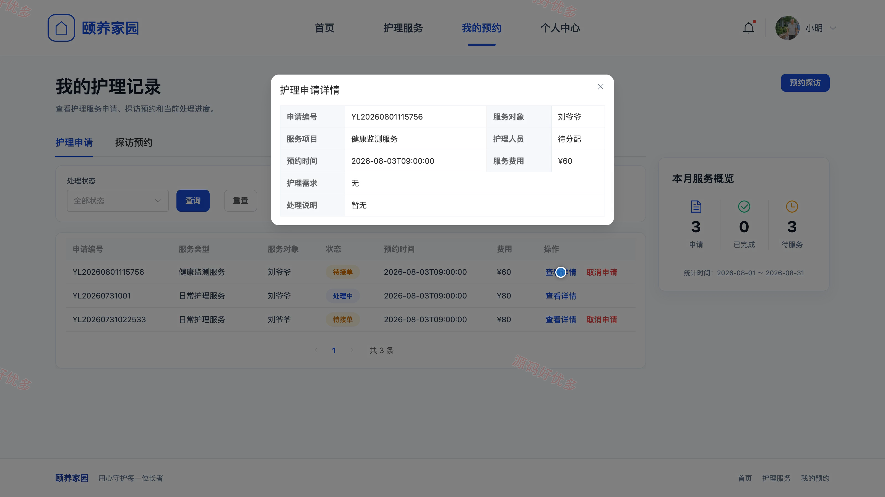
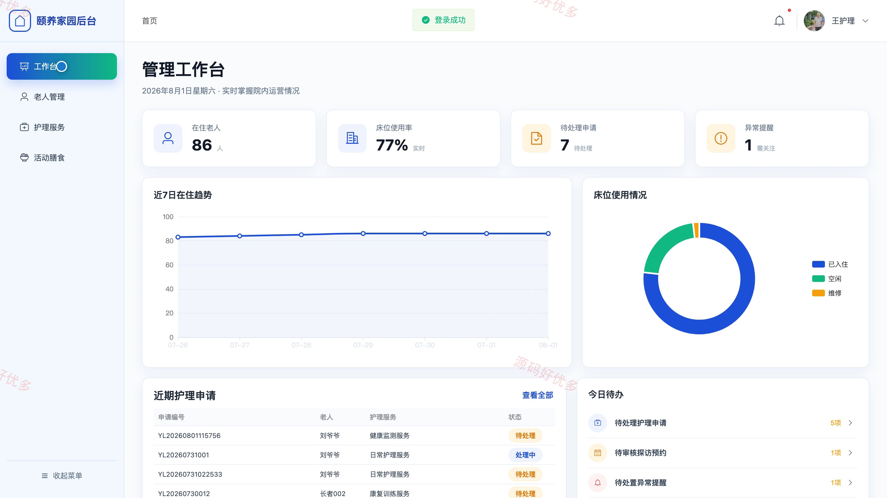
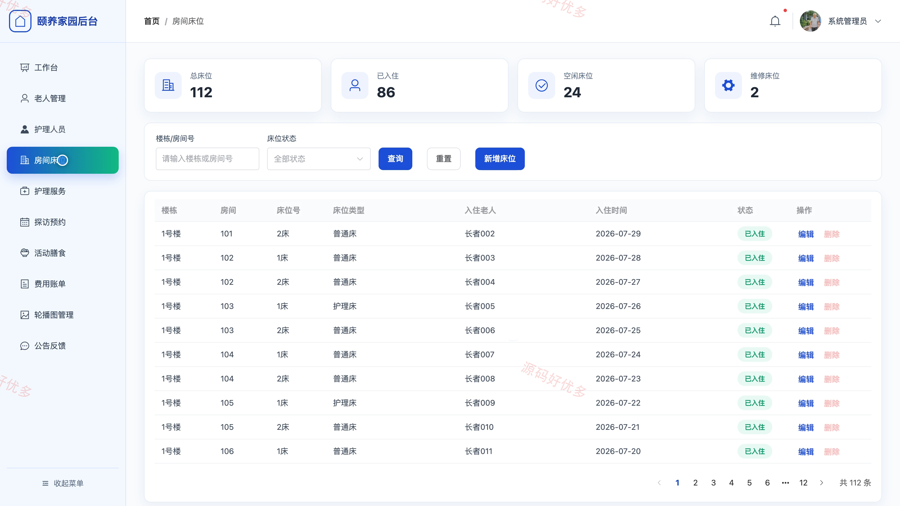
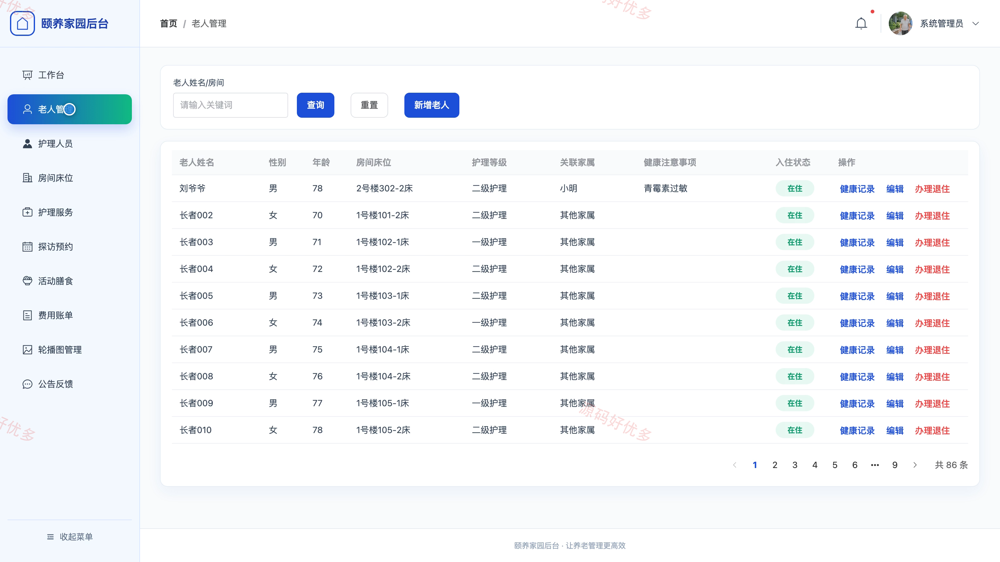
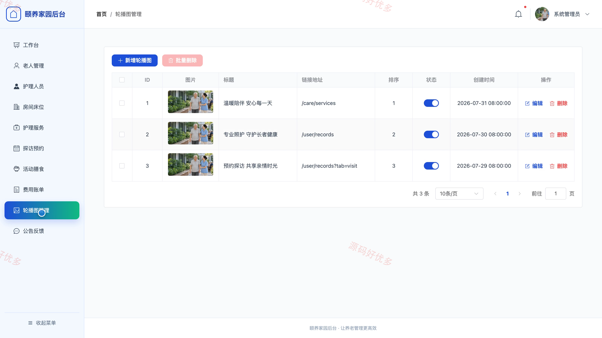

# bs012A
bs012A养老院管理系统
## 源码问题查看主页咨询

### 一、关键词
养老院、敬老院、护理服务、老人入住、探访预约

### 二、作品包含
源码+数据库+全套环境和工具资源+本地部署教程

### 三、项目技术
前端技术： Html、Css、Js、Vue3.4、Element-Plus
后端技术：Java、SpringBoot3.2.0、MyBatis-Plus

### 四、运行环境（以下版本亲测，其他版本兼容性请自行测试）
开发工具：IDEA/eclipse + VSCODE

数据库：MySQL5.7+（共15张表）

数据库管理工具：Navicat10以上版本

环境配置软件： JDK17 + Maven3.6.3

前端Nodejs：16+

浏览器：谷歌浏览器

### 五、项目介绍
项目编号：bs012A

养老院管理系统面向家属、护工、管理员，提供项目核心业务等功能，实现各角色在系统中的实际业务协作。

角色：家属、护工、管理员

家属功能：浏览首页轮播图与院内公告并查看公告详情、浏览护理服务项目、选择入住老人提交护理申请并支持暂存草稿、在我的预约中查询护理申请进度与申请详情、在线提交探访老人预约并查看审核结果、报名参加院内活动、提交意见反馈并查看回复、个人中心维护资料并修改登录密码。

护工功能：工作台查看护理申请与待办业务概况、接收护理申请并更新服务处理状态、查看老人档案与健康记录、查看院内活动安排与每日膳食信息、维护个人资料。

管理员功能：工作台总览护理申请与业务运营情况、老人档案与健康记录管理、老人入住退住与房间床位安排管理、护理人员账号新增与维护、护理服务项目配置与申请分派处理、家属探访预约审核、院内活动发布与每日膳食管理、费用账单生成与轮播图公告反馈维护。

### 六、运行截图

